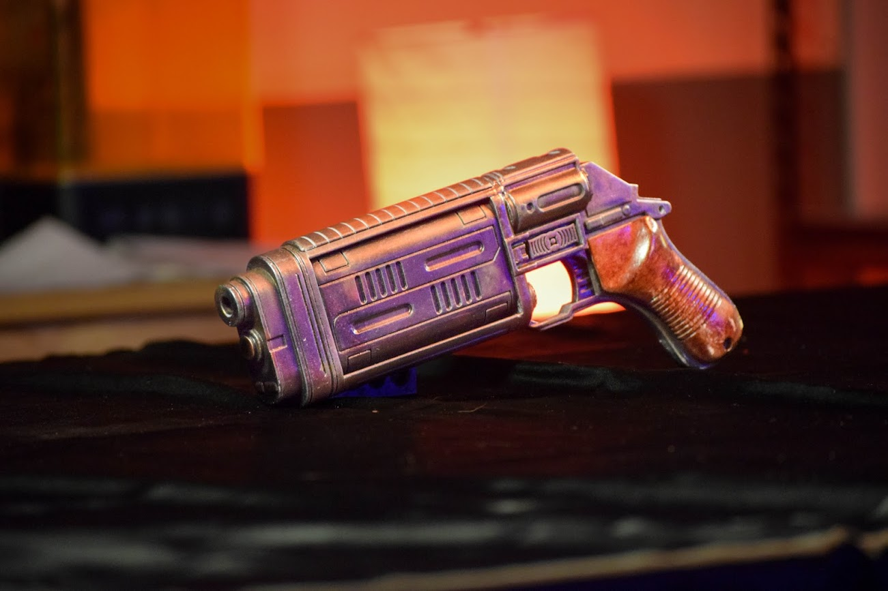
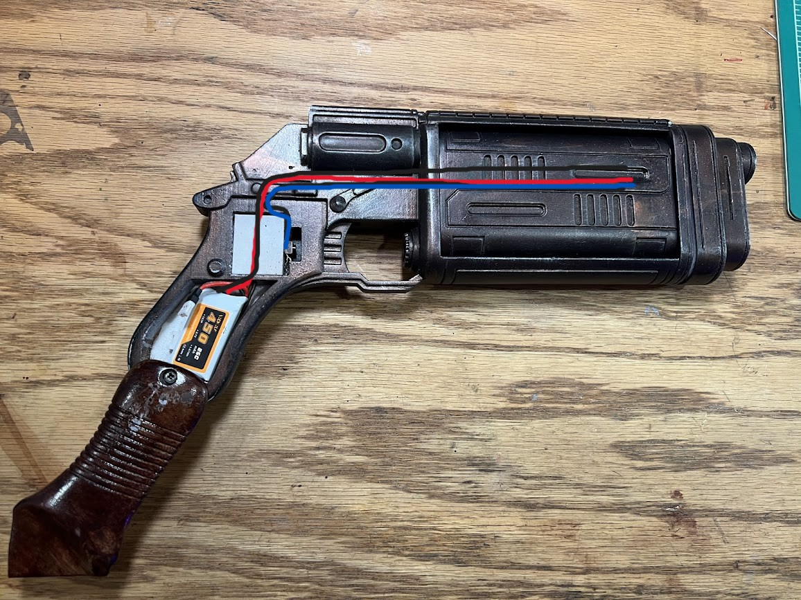
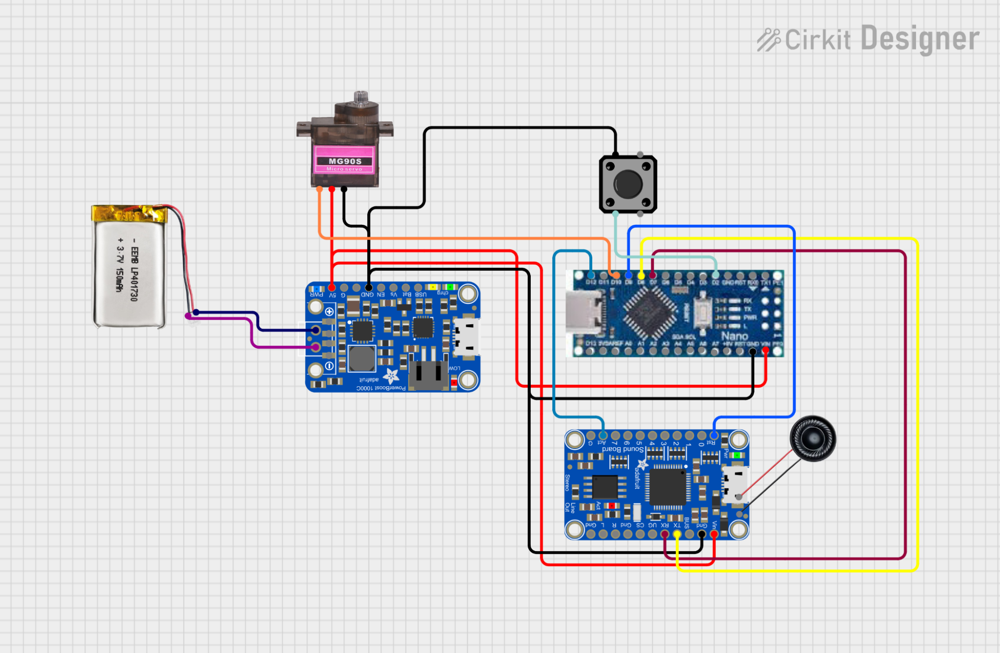
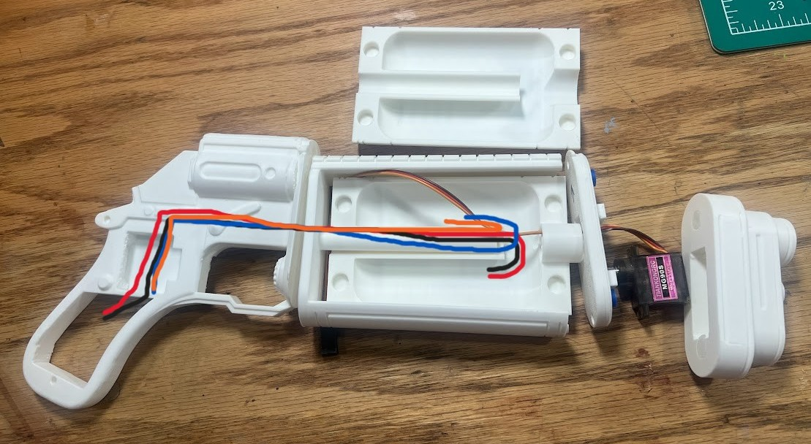
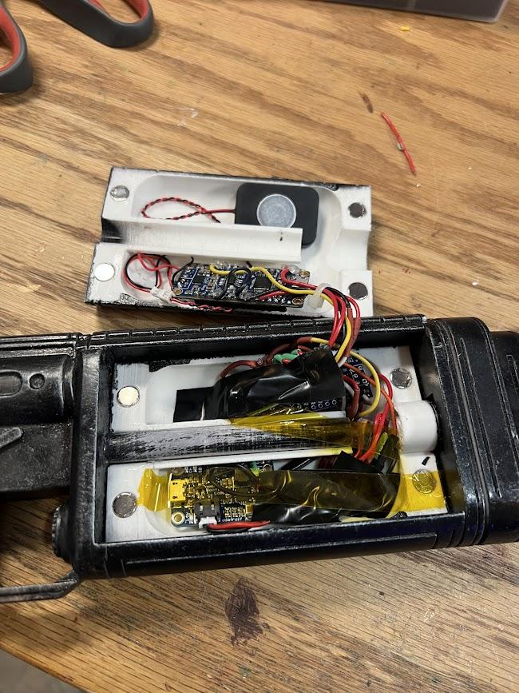

# Andor Pistol — Electronics & Servo Build Writeup

This document describes the process of adding working electronics and servo-driven mechanical animation to the 3D-printed Star Wars Andor pistol prop by MysteryMakers. The build includes a sound system capable of playing blaster and alternate sound effects, a servo-actuated moving component, and a single-button interface to control everything. Power is provided by a rechargeable LiPo battery with a regulated 5V supply.

---

## Update 7/20/26

Added new file AndorPistol-NoAudio.ino
This file removes all the audio portions of the code in case you only want to use the servo to spin the barrel. It aslo doesn't have a delay in spinning, just spins when the trigger is pressed.

---

## 3D Model & Print Notes

Model from MysteryMakers:

- Patreon: <https://www.patreon.com/cw/mysterymakers>
- Cults3D model page: <https://cults3d.com/en/3d-model/various/andor-cassians-bryar-pistol>
- Full blaster configuration: <https://cults3d.com/en/3d-model/various/mw20-blaster-rifle-configuration-mysterymakers>

I printed mine in ABS because it's easier to sand and finish. PLA would work fine as well. I printed this as part of the full blaster configuration, which is a **fantastic** model, and this was fun to build.

- Pistol Showcase: <https://www.instagram.com/mirrorbrightcosplay/reel/DXWuK6rjmWj/>
- Full Blaster Assembley: <https://www.instagram.com/mirrorbrightcosplay/reel/DX75IciN_oa/>
- Full Blaster Glamour Shots: <https://www.instagram.com/p/DXjxnaqjs0w>

---

## Components

| Component | Role |
|---|---|
| Arduino Nano | Main microcontroller. Handles all logic: reading button input, triggering sounds, and controlling the servo. |
| MG90S Servo | Metal-gear micro servo. Drives the barrel rotation animation. |
| Adafruit Audio FX Sound Board + 2x2W Amp | Stores and plays audio files over SoftwareSerial (UART). Includes a built-in stereo amplifier. |
| 4 Ohm 3W Speaker | Outputs blaster and alternate sound effects. |
| Adafruit PowerBoost 1000 Basic | Boosts the 3.7V LiPo to a regulated 5V to power all components. |
| 3.7V LiPo Battery | Main power source. |
| Tactile Button Switch | Single button input used to fire sounds and switch sound banks. |

---

## Component Placement

The battery wires run underneath the trigger box, then join the push button wires through the guide and into the barrel to attach to the PowerBoost and Nano.

All other components are stuffed into the barrel itself.

---

## Wiring

All components are powered from the Adafruit PowerBoost 1000, which accepts the 3.7V LiPo and outputs a stable 5V rail. The servo and Audio FX board draw power directly from this rail rather than from the Arduino's 5V pin, which cannot supply enough current for both reliably.

### Pin assignments (Arduino Nano)

| Pin | Connection | Notes |
|---|---|---|
| D3 | Button input | INPUT_PULLUP — button connects D3 to GND, no resistor needed |
| D7 | SoftwareSerial TX -> Audio FX Board RX | 9600 baud |
| D8 | SoftwareSerial RX <- Audio FX Board TX | 9600 baud |
| D9 | Audio FX Board RST | Reset line, driven by Adafruit library on startup |
| D10 | Servo PWM signal | Detached during serial comms to prevent jitter |
| D12 | Audio FX Board ACT (input) | Reads LOW when audio is playing |

> **Note:** The servo is deliberately detached from the PWM signal during audio playback and reattached immediately after. This prevents the SoftwareSerial timer from causing jitter on the servo wire during serial communication.

> **Note:** These are the Nano digital pins I decided on. If you want to move the button input to D2, nothing should stop you.

---

## How It Works

The build is controlled entirely by a single tactile button. There are two interactions:

### Short press — fire

Pressing and quickly releasing the button triggers a blaster sound effect. The Audio FX board has up to six blaster sound files loaded (BLASTER1.WAV through BLASTER6.WAV), and one is chosen at random on each press. After the button is released, a 2-second cooldown timer starts. When the timer expires with no further input, the servo toggles position, flipping the barrel.

### Long press (2 seconds) — switch sound bank

Holding the button for 2 seconds switches between two sound banks: the default blaster sounds, and an alternate "Lizard" sound effect (LIZZZARD.WAV). The switch is silent, and the next short press will play from the newly selected bank. Holding again switches back.

The `safeStop()` function checks the ACT pin before every sound trigger. If audio is already playing (ACT reads LOW), it stops playback before firing the new sound. This ensures clean, non-overlapping audio even when firing quickly.

---

## Audio File Setup

Sound files must be loaded onto the Audio FX board's onboard flash storage. The board presents as a USB drive when connected to a computer.

### Required files

| Filename | Description |
|---|---|
| BLASTER1.WAV - BLASTER6.WAV | Blaster fire sounds (one chosen at random per press) |
| LIZZZARD.WAV | Alternate sound effect (long-press mode) |

Files should be 16-bit, 44.1kHz WAV format for best compatibility with the board. The board's built-in 2x2W amplifier drives the 4 Ohm 3W speaker directly with no external amplifier needed.

The sound files I used are in this repo under `sounds/`.

### Editor's Note

This setup is overly complicated because I wanted the pistol to behave a certian way. It would be simpler to have the nano trigger the sound files via their trigger pins instead of SoftwareSerial, and for you that might be better. 

Full soundboard tutoral here: <https://learn.adafruit.com/adafruit-audio-fx-sound-board/downloads>

---

## Assembly

To attach the servo to the barrel, I found the best method was to enlarge the hole in the barrel a little bigger, then cut off a horn that came with the MG90S servo and glue it in. The servo wires will go in the holes provided, and won't interfere with the barrel rotation.

When soldering the components together, I would suggest being as compact as possible. There is not a lot of room in the barrel for everything, and I barely made it work. Of course, if you are only wanting the rotation and not the sound, all the components should fit easily.

Excuse the mess.

---

## Arduino Sketch

The full Arduino sketch (`AndorPistol.ino`) is included with this project. Key libraries required:

- `Servo.h` — built into Arduino IDE
- `SoftwareSerial.h` — built into Arduino IDE
- `Adafruit_Soundboard.h` — install via Arduino Library Manager: search "Adafruit Soundboard"

The code is a bit of a mess, but it works for how I had it in my head. A simple delay before rotating the barrel is easy to extract from the code.

---

## Parts List & Links

These are the specific components I used, but a few are common enough that any equivalent version would do.

| Component | Link |
|---|---|
| MG90S Servo | <https://www.amazon.com/dp/B0925V3X2S> |
| Arduino Nano | <https://www.amazon.com/dp/B0713XK923> |
| 4 Ohm 3W Speaker | <https://www.amazon.com/dp/B0F3CY5ZD2> |
| Adafruit Audio FX Sound Board + 2x2W Amp | <https://www.adafruit.com/product/2210> |
| Adafruit PowerBoost 1000 Basic | <https://www.adafruit.com/product/1903> |
| Tactile Button Switch | <https://www.adafruit.com/product/367> |
| 3.7V LiPo Battery | <https://www.amazon.com/dp/B0C4NTP1YF> |

---

## More Questions?

Send me a message on Instagram: <https://instagram.com/mirrorbrightcosplay>
